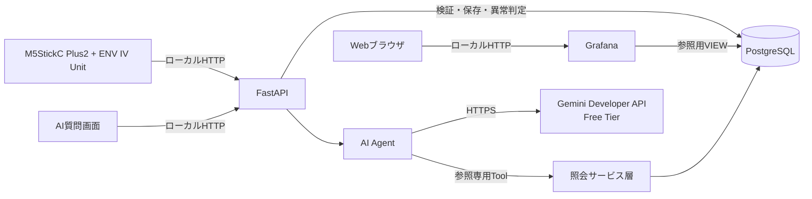
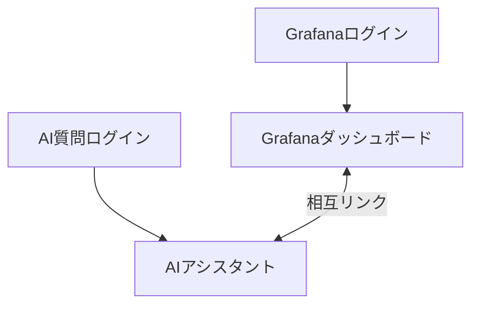

# SoraSense 基本設計書

## 2. 設計方針

### 2.1 対象範囲

M5StickC Plus2による温湿度計測、HTTP APIによる収集、PostgreSQLへの保存、Grafanaによる閲覧、異常検知、Gemini Developer APIによる自然言語照会を対象とする。

### 2.2 基本方針

- データ収集とAI処理を分離し、外部AIサービス障害時も収集を継続する。
- 日時はUTCで保存・交換し、画面表示および日・時単位の集計境界は`Asia/Tokyo`に固定する。利用者によるタイムゾーン選択は提供しない。
- AI Agentには参照専用Toolだけを許可する。
- 通常閲覧はGrafana OSS、独自UIは一問一答のAI質問画面だけとする。
- Grafanaは参照用VIEWをSELECT専用DBユーザーで参照する。
- デバイスおよび監視条件を変更する画面・APIは提供しない。
- 初期リリースは単一利用者、センサーデバイス1台とする。
- 初期リリースは管理者が管理するローカルネットワーク内で運用し、ローカル通信にはHTTP、Gemini Developer APIとの外部通信にはHTTPSを使用する。
- AI Agentは課金を有効化していないGemini Developer APIのFree Tierを使用し、有料枠へ自動切替しない。
- Docker Composeで開発環境と本番相当環境を再現可能にする。

### 2.3 技術構成

| 区分 | 採用技術 | 主な責務 |
|---|---|---|
| センサーデバイス | M5StickC Plus2 / ENV IV Unit / Arduino | 温湿度取得、ローカルHTTP送信、失敗時再送 |
| バックエンド | Python / FastAPI | 受信、検証、保存、異常判定、AI質問画面 |
| DBアクセス | SQLAlchemy / Alembic | DBアクセス、スキーマ変更管理 |
| データベース | PostgreSQL | 測定値、アラート、AI利用履歴の永続化と集計 |
| AI Agent | Google Gen AI SDK / Gemini Developer API | Tool選択、回答生成、利用量記録 |
| 可視化UI | Grafana OSS | 現在値、履歴、統計、アラート、デバイス状態の閲覧 |
| AI質問UI | FastAPI / Jinja2 / HTMLフォーム / CSS | 質問入力、回答と根拠の表示 |
| 実行環境 | Docker / Docker Compose | 環境再現、サービス管理 |

## 3. システム構成

### 3.1 論理構成

FastAPIは測定データ受信とAI質問を同一サービスで提供するが、ルーターとサービス層を分離する。測定データ受信処理はGemini Developer APIを呼び出さない。Grafanaは独立サービスとする。

### 3.2 構成要素と責務

| 構成要素 | 責務 | 障害時の扱い |
|---|---|---|
| M5StickC Plus2 | センサー読取、定期送信、失敗時再送 | 計測を継続しながら上限付きで再送する |
| FastAPI | 受信、検証、重複排除、保存、異常判定、AI質問、ヘルスチェック | DB利用不能時は再送可能な応答を返す |
| PostgreSQL | 測定値、アラート、AI利用履歴の保存 | 永続ボリュームとバックアップから復旧する |
| Grafana | 参照用VIEWによるダッシュボード表示 | 停止しても収集・保存・AI照会は継続する |
| AI Agent | 質問解釈、Tool選択、根拠付き回答 | 停止しても収集・保存・Grafana閲覧は継続する |

### 3.3 配置方針

Docker ComposeにFastAPI、PostgreSQL、Grafanaを配置する。FastAPIはセンサーデバイスから到達可能なホストのLANアドレスへHTTPで公開し、GrafanaとAI質問画面も管理対象のローカルネットワーク内だけから利用する。PostgreSQLは内部ネットワークだけに接続する。Gemini Developer APIへの外部通信はHTTPSを使用する。永続化対象はPostgreSQLデータとし、Grafana設定は構成ファイルから再生成可能にする。

## 4. 機能・処理方式

### 4.1 測定データ収集

デバイスは温湿度、測定日時、メッセージID、デバイスIDをHTTP APIへ送信する。FastAPIは認証と入力検証後、メッセージIDで重複を排除して測定値を保存し、同じトランザクションで異常状態を更新する。

一時的な通信・サーバー障害では同じメッセージIDを用いて上限付き指数バックオフで再送する。計測は停止せず、最新の未送信データ1件だけをメモリに保持する。端末再起動をまたぐ未送信データの永続化は行わない。

### 4.2 閲覧・集計

最新値、指定期間の履歴、日単位等の集計、最小・最大・平均値をPostgreSQLで取得・算出する。Grafanaは参照用VIEWを通じて表示し、最終受信日時は測定データの受信日時から求める。

### 4.3 異常判定

温度・湿度の上下限と復帰幅を設定ファイルで管理し、FastAPI起動時に読み込む。閾値超過でアラートを開始し、同一異常の継続中は重複登録せず、復帰条件を満たしたときに解消する。監視条件変更は設定ファイルと再起動で反映し、過去データは再判定しない。

### 4.4 デバイス状態

測定データの最終受信日時と現在時刻との差から、`ONLINE`、`STALE`、`OFFLINE`を動的に判定する。

### 4.5 AI Agent

AI質問は一問一答とし、過去の質問・回答を次の質問へ渡さない。Agentは照会サービス層が提供する参照専用Toolだけを利用し、取得結果に基づいて回答する。回答には対象期間と主要な根拠値を含め、利用量とエラーを記録する。Tool呼出しとAgent処理には上限を設ける。

## 5. 外部・内部インターフェース方針

| インターフェース | 利用者 | 方式 | 目的 |
|---|---|---|---|
| 測定データ受付 | センサーデバイス | ローカルHTTP API、APIキー認証 | 測定値の検証・保存・異常判定 |
| AI質問 | 利用者 | Jinja2で生成するHTMLフォーム | 一問一答の質問と回答表示 |
| ヘルスチェック | システム管理者 | 内部向けHTTP API | FastAPI、必要設定、DB接続の確認 |
| データ閲覧 | 利用者 | Grafana | 現在値、履歴、集計、異常履歴、デバイス状態の表示 |
| Agent Tool | AI Agent | FastAPI内部の照会サービス呼出し | 保存済みデータの参照 |

利用者向けの閲覧APIは提供せず、GrafanaがPostgreSQLの参照用VIEWを直接参照する。Swagger UIおよびReDocは本番環境では無効化し、開発環境ではAPIの動作確認に利用できるよう有効化してよい。OpenAPI定義は開発・テストで利用し、本番環境では外部公開しない。APIの保護は、これらの無効化ではなく、認証、認可およびネットワークのアクセス制御によって行う。具体的なパス、要求・応答、入力検証およびエラーは詳細設計書で定義する。

## 6. AI Tool構成

| Tool分類 | 主な用途 |
|---|---|
| 最新値照会 | 最新の温度・湿度と測定日時の取得 |
| 測定データ照会 | 指定期間の履歴、統計、時系列集計の取得 |
| 期間比較 | 2期間の統計と差分の取得 |
| アラート照会 | 指定期間のアラート履歴の取得 |

Toolは生SQLや任意URLを受け取らず、構造化した結果を返す。具体的なTool名、引数、件数制限は詳細設計書で定義する。

## 7. 論理データ設計

### 7.1 データ構成

初期リリースでは次の4種類を永続化する。単一デバイスと単一利用者の認証情報は環境変数で管理する。

| データ | 主な情報 | 用途 |
|---|---|---|
| 登録デバイス | デバイスID、登録日時 | 未受信を含む状態判定、同時更新の直列化 |
| 測定データ | デバイスID、メッセージID、測定日時、温度、湿度、受信日時 | 履歴、集計、重複排除、状態判定、欠損識別 |
| アラート | デバイスID、項目、方向、状態、発生時の閾値・測定値、発生・解消日時 | 異常の継続管理と履歴表示 |
| AI利用履歴 | 質問、回答、処理結果、トークン利用量、エラー、実行日時 | 利用状況と障害の確認 |

登録デバイスと測定データ・アラートの間にはデバイスIDによる外部キー関係を設ける。AI利用履歴には外部キー関係を設けない。物理テーブルのカラム、型、制約、索引は詳細設計書で定義する。

### 7.2 Grafana参照用データ

PostgreSQLの`reporting`スキーマに、最新値、デバイス状態、時系列、測定データ欠損区間、アラート履歴を提供するVIEWを配置する。デバイス状態は登録デバイスを基点に算出し、受信実績がないデバイスも`OFFLINE`として返す。GrafanaにはVIEWのSELECT権限だけを与え、基底テーブルの変更権限を与えない。

### 7.3 データ保持

初期リリースでは業務データの自動削除を行わず継続保持する。必要時の手動削除はバックアップ取得後に運用作業として実施する。

## 8. UI設計

### 8.1 画面一覧

| 画面 | 主な表示・操作 |
|---|---|
| Grafanaログイン | Grafanaユーザー認証 |
| Grafanaダッシュボード | デバイス状態、最新温湿度、最終受信、履歴、統計、アラート履歴 |
| AI質問ログイン | AI質問画面の利用者認証 |
| AIアシスタント | 質問入力、回答、対象期間、根拠値、エラー |

### 8.2 画面遷移

管理画面は設けない。GrafanaとAI質問画面は相互に移動できるようにする。

### 8.3 表示方針

Grafanaは現在値、状態、時系列、統計、アラートを表示する。期間指定にはGrafana標準機能を利用する。AI質問画面はJinja2によるサーバーサイドレンダリングの1画面とし、クライアントサイドJavaScriptを使用しない。

## 9. セキュリティ設計

- 測定APIは環境変数の単一デバイスIDとAPIキーハッシュで認証する。
- Grafanaは標準のローカル認証を利用し、匿名アクセスを無効にする。
- AI質問画面は環境変数の単一利用者情報で認証し、セッションCookieとCSRF対策を用いる。
- GrafanaとAI質問画面の認証情報は別々に管理する。
- 秘密情報は環境変数またはSecret機構から取得し、ソースやログへ出力しない。
- ローカルHTTPサービスは管理対象LANだけに公開し、ホストのバインド先とファイアウォールでインターネットからの直接アクセスを拒否する。
- Gemini Developer APIとの外部通信はHTTPSとし、APIキーはFree Tierプロジェクトに限定する。Geminiへの送信内容は質問、Instructionsおよび回答に必要なTool結果だけに制限する。

具体的なハッシュ方式、Cookie属性、有効期限、環境変数名および制限値は詳細設計書で定義する。

## 10. ログ・監視設計

構造化ログを標準出力へ出し、処理結果とエラーを相関IDで追跡可能にする。秘密情報、質問・回答本文および測定値の全件はログへ出力しない。初期リリースはヘルスチェックとログを監視の基本とし、受信結果、デバイス状態、API状態、DB状態、AI利用状態を確認対象とする。

## 11. バックアップ・復旧設計

PostgreSQLを日次でバックアップし、DB本体とは異なる保存先に暗号化して保管する。月次で復元確認を行い、RPO 24時間、RTO 4時間を満たす。復旧はPostgreSQL、FastAPI、Grafanaの順に行う。

## 12. 性能・可用性設計

- 1台から1分間隔で送られる測定データを24時間継続処理できる構成とする。
- 30日分のデータを1人が閲覧する通常利用条件で、最新値、履歴、集計の表示性能要件を満たす。
- 時系列検索に適した索引とDB接続管理を採用する。
- 外部AIサービスおよびDBへの接続にはタイムアウトを設け、無制限な再試行を行わない。
- 外部AIサービス障害が収集・保存・Grafana閲覧に波及しない構成とする。

## 13. テスト方針

| テスト種別 | 主な対象 |
|---|---|
| 単体 | 入力検証、集計、状態判定、異常判定、Agent制御 |
| 結合 | FastAPI・PostgreSQL、Grafana・PostgreSQL、AI質問画面 |
| E2E | デバイス相当クライアントから保存・表示・質問まで |
| 障害 | DB、FastAPI、外部AIサービスの停止と復旧 |
| 性能 | 受信継続性とGrafana表示性能 |
| セキュリティ | 認証、権限、入力検証、秘密情報露出 |

CIでは静的解析、型チェック、単体・結合テスト、依存脆弱性検査を行う。具体的なテストケースとデータは詳細設計書で定義する。

## 14. 要件トレーサビリティ

| 要件群 | 主な設計章 | 受入条件 |
|---|---|---|
| FR-001～005 デバイス・収集 | 3、4.1、5 | AC-001 |
| FR-010～016 データ管理 | 4.1、4.2、7 | AC-001、AC-002 |
| FR-020～023 環境状態 | 4.2、7、8 | AC-002 |
| FR-030～034 異常検知 | 4.3、7、8、9 | AC-003 |
| FR-040～048 AI Agent | 3、4.5、5、6、7 | AC-004、AC-005、AC-009 |
| FR-050～052 状態確認 | 4.4、5、8、10 | AC-006 |
| FR-060～063 利用者UI | 5、8、9 | AC-002～004 |
| NFR-001～003 性能 | 4、7、12、13 | AC-001、AC-005、AC-007 |
| NFR-010～012 可用性 | 3、11～13 | AC-005、AC-008 |
| NFR-020～025 セキュリティ・ネットワーク境界 | 3、5、6、9、10 | AC-009 |
| NFR-030～033 信頼性 | 4、5、7、10 | AC-004、AC-006、AC-010 |
| NFR-040～043 保守性 | 2、3、7、13 | AC-011 |
| NFR-050～053 利用コスト | 4.5、6、7、10 | AC-004 |

## 15. 詳細設計への引継ぎ事項

- Arduino側の利用ライブラリ、時刻同期、送信・再送アルゴリズム
- HTTP APIの要求、応答、認証、検証、エラー仕様
- モジュール、クラス、関数およびトランザクション境界
- 物理テーブル、VIEW、索引およびマイグレーション
- AI Toolの入出力、Agent Instructionsおよび制限値
- HTMLフォーム、セッション、CSRFおよびエラー表示
- ログイベント、例外処理、設定値およびテストケース
- 本番のリバースプロキシ、証明書、Secret、バックアップ保存先
