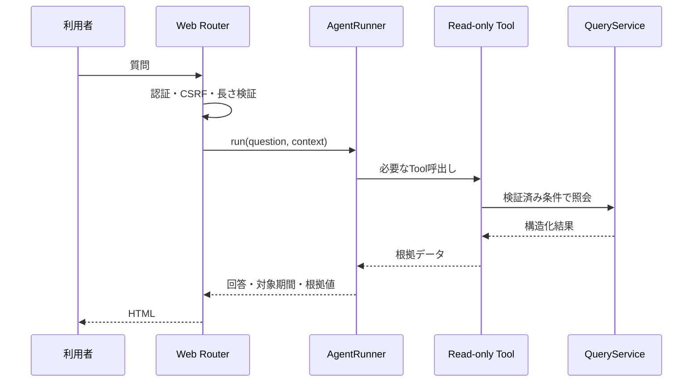

# SoraSense 詳細設計書 — AI Agent

## 1. 文書情報

| 項目 | 内容 |
|---|---|
| 文書版数 | 0.1.0 |
| 入力文書 | 要件定義書 v0.1.0、基本設計書 v0.3.0 |
| 対象 | OpenAI Agents SDK、Agent Instructions、参照専用Tool、利用量記録 |

### 1.1 変更履歴

| 版数 | 日付 | 変更内容 |
|---|---|---|
| 0.1.0 | 2026年8月21日 | Toolの表示・集計タイムゾーンをAsia/Tokyoに固定 |
| 0.0.0 | 2026年8月13日 | 版数管理開始時点のAI Agent詳細設計を登録 |

## 2. 処理境界

AI質問は一問一答であり、過去の質問、回答、Tool結果を次の質問へ渡さない。測定データ受付処理からAgentを呼び出さない。Agentは`QueryService`の型付き参照メソッドだけをToolとして利用し、DB接続、SQL、HTTP URL、ファイル操作、更新処理を公開しない。

## 3. 質問処理シーケンス

入力検証で拒否する質問ではAgentを生成せず、OpenAI APIを呼び出さない。実行前に`ai_requests`へRUNNINGを記録し、終了時に成功・失敗、モデル、Tool回数、トークン数を更新する。

AgentRunnerは、質問中に実行した各Toolの名前、正規化済み入力、構造化結果および呼出し順をリクエスト内の実行履歴として保持する。モデルへ渡したTool結果と検証に使用するTool結果は同一オブジェクトを正本とし、モデルが返した値を根拠データの正本として扱わない。実行履歴はリクエスト終了時に破棄し、質問・回答とは別にDBへ保存しない。

## 4. Tool仕様

### 4.1 共通規則

- `device_id`は初期リリースの設定済みIDと一致する値だけを許可する。
- `from`、`to`はISO 8601で受け、`from < to`を必須とする。
- 表示および集計タイムゾーンは`Asia/Tokyo`に固定し、Tool入力として`timezone`を受け付けない。
- Tool結果には`data_status`として`AVAILABLE`、`NO_DATA`、`UNAVAILABLE`のいずれかを含める。
- Tool例外を生のままモデルへ渡さず、安全なコードと再試行可否へ変換する。

### 4.2 Tool一覧

| Tool | 入力 | 出力 | 制限 |
|---|---|---|---|
| `get_latest_measurement` | `device_id` | 温度、湿度、測定日時、受信日時 | 1件 |
| `get_measurement_statistics` | `device_id`, `from`, `to` | 各項目の最小・最大・平均・件数、固定タイムゾーン`Asia/Tokyo` | 最大90日 |
| `get_measurement_series` | `device_id`, `from`, `to`, `granularity` | バケット、平均、最小、最大、件数、固定タイムゾーン`Asia/Tokyo` | 最大90日、500点 |
| `compare_periods` | `device_id`, 2期間 | 両期間の統計と絶対差、固定タイムゾーン`Asia/Tokyo` | 各期間最大90日 |
| `get_alert_history` | `device_id`, `from`, `to`, `status` | アラート配列、総件数、切詰め有無 | 最大100件 |

`granularity`は`hour`または`day`に限定する。500点を超える指定は自動切詰めせず入力エラーとする。アラート状態は`OPEN`、`RESOLVED`、`ALL`とする。

## 5. Agent Instructions

Instructionsには少なくとも次を記載する。

1. SoraSenseに保存された温度・湿度・アラートだけを回答対象とする。
2. 数値を述べる場合は必ずTool結果を根拠とし、計算する場合も入力値と計算式を明示する。
3. 対象期間、固定タイムゾーン`Asia/Tokyo`、主要な根拠値を回答に含める。
4. `NO_DATA`は「該当データなし」、`UNAVAILABLE`は「現在取得不能」と区別する。
5. Tool結果にない原因、健康影響、安全性を断定しない。
6. データ変更・削除、任意SQL、任意URLへのアクセス要求は実行できないと説明する。
7. 質問が曖昧で期間を決められない場合は、推測せず必要な条件を質問する。
8. 日本語で簡潔に回答し、単位を温度℃、湿度%として明示する。

## 6. 制限値

| 項目 | 上限 |
|---|---:|
| 質問文字数 | 2000文字 |
| Tool呼出し | 5回／質問 |
| Agentターン | 8回／質問 |
| OpenAI応答待ち | 30秒／呼出し |
| Agent全体 | 60秒／質問 |
| アプリ側自動再試行 | 一時エラー時1回まで |

上限到達時は処理を停止し、`LIMIT_EXCEEDED`として記録する。外部AI障害は`AI_UNAVAILABLE`として画面へ返し、収集・Grafana・DBへ影響させない。

## 7. Agent出力契約

AgentRunnerはモデルに自由文だけでなく次の構造を返させる。モデル出力は表示用回答の候補であり、根拠データの正本ではない。

| フィールド | 内容 |
|---|---|
| `answer` | 利用者向け回答 |
| `period_from`, `period_to` | 根拠期間。現在値のみの場合はNULL可 |
| `timezone` | 固定表示タイムゾーン`Asia/Tokyo` |
| `evidence` | 項目名、値、単位、測定・集計時刻の配列 |
| `data_status` | `AVAILABLE` / `NO_DATA` / `UNAVAILABLE` |

AgentRunnerはモデル出力の構造検証後、保持しているTool実行履歴を正本として、次の意味検証と根拠値確定を行う。

1. `evidence`の各要素が、実際に実行したTool結果の項目、値、単位および測定・集計時刻と一致することを確認する。文字列表現の差はDTOで定義した正規化後の値で比較し、数値の丸めはTool DTOの表示精度だけを許可する。
2. `period_from`、`period_to`および`data_status`が根拠に使用したToolの入力・結果と一致し、`timezone`が固定値`Asia/Tokyo`であることを確認する。
3. `answer`から温度、湿度、件数、差分その他の測定データ由来の数値を抽出し、Tool結果またはTool結果だけを入力とする明示された計算で再現できることを確認する。許可する計算は差、増減率およびTool結果に含まれる集計値同士の比較とし、ゼロ除算など計算不能な場合は数値を生成しない。
4. 検証成功後、表示用`evidence`はモデル出力をそのまま採用せず、対応するTool実行履歴からAgentRunnerが再構築する。

構造または意味検証に失敗した場合、AgentRunnerは回答と根拠値を返さず、`ai_requests`を`FAILED`、`error_code`を`AI_RESPONSE_INVALID`として更新する。Web層は未検証のモデル出力を表示せず、安全なエラーとリクエストIDだけを返す。検証のためにAgentを再実行しない。

## 8. 利用量とプライバシー

質問・回答、モデル、Tool回数、入出力トークン、結果を`ai_requests`へ保存する。構造化ログには質問・回答本文を出さない。OpenAIへ渡すのは質問、Instructions、回答に必要なTool結果だけとし、APIキー、DB情報、セッション情報、他のログを含めない。
