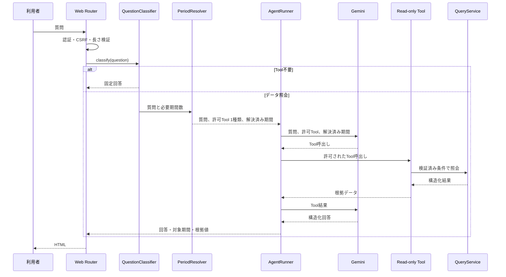

# SoraSense 詳細設計書 — AI Agent

## 2. 処理境界

AI質問は一問一答であり、過去の質問、回答、Tool結果を次の質問へ渡さない。測定データ受付処理からAgentを呼び出さない。Agentは`QueryService`の型付き参照メソッドだけをToolとして利用し、DB接続、SQL、HTTP URL、ファイル操作、更新処理を公開しない。

## 3. 質問処理シーケンス

長さ検証で拒否する質問およびQuestionClassifierがTool不要と分類した質問ではAgentを生成せず、Gemini Developer APIとQueryServiceを呼び出さない。Tool不要分類は固定回答をそのまま表示し、外部AI利用記録である`ai_requests`へ保存しない。データ照会に分類した質問は、実行前に`ai_requests`へRUNNINGを記録し、終了時に成功・失敗、モデル、Tool回数、トークン数を更新する。

### 3.1 質問分類

QuestionClassifierはUnicodeをNFKC正規化し、大文字・小文字と空白の差を吸収した文字列へ決定的な規則を適用する。分類の優先順位は、未対応操作、ヘルプ、対象外、期間比較、アラート履歴、時系列、統計、最新値、条件確認の順とする。不明な質問を推測でデータ照会へ分類せず、条件確認へ倒す。

| 分類 | 判定に必要な内容 | 処理 |
|---|---|---|
| 最新値 | 温度・湿度等のデータ語と、最新・現在等の現在値語 | `get_latest_measurement`だけを公開 |
| 統計 | 温度・気温・室温・湿度等のデータ語、期間、平均・最小・最低・最大・最高・件数・ピーク・最も高い／低い等の統計語 | `get_measurement_statistics`だけを公開 |
| 時系列 | データ語、期間、推移・時系列・変化等の系列語 | `get_measurement_series`だけを公開 |
| 期間比較 | データ語、比較語、識別可能な2期間 | `compare_periods`だけを公開 |
| アラート履歴 | アラート語と期間 | `get_alert_history`だけを公開 |
| 条件確認 | 必要なデータ種別や期間が不足、または分類不能 | 不足条件を求める固定回答 |
| 未対応操作 | 更新・変更・削除・SELECTを含む任意SQL・任意URL・ファイル操作 | 実行不能を示す固定回答 |
| 対象外 | 原因、健康影響、診断、安全性等の判断要求 | 対象範囲を示す固定回答 |
| ヘルプ | 機能や使い方の質問 | 利用可能な照会を示す固定回答 |

### 3.2 期間解決

PeriodResolverは注入可能なClockを`Asia/Tokyo`へ変換し、質問中の期間を開始含む・終了含まない半開区間へ解決する。単一期間が必要な質問で複数期間が指定され、`から`と`まで`で1区間に結合できない場合、期間が90日を超える場合、または期間が不正・未対応の場合は条件確認の固定回答を返し、GeminiとQueryServiceを呼び出さない。既知の期間表現へ「以外」「以前」「以降」「より前」「より後」「ではない」「除く」等の未対応修飾が続く場合は部分一致で解決しない。期間比較は質問内の出現順で2区間を解決し、各区間へ90日上限を適用する。

| 表現 | 解決規則 |
|---|---|
| 今日 | 当日00:00以上、Clock時刻未満 |
| 昨日・一昨日 | 対象日の00:00以上、翌日00:00未満 |
| 今週・今月・今年 | 対象期間の開始以上、Clock時刻未満。ただし90日以内に限る |
| 先週・先月・昨年 | 対象期間の開始以上、次期間の開始未満。ただし90日以内に限る |
| 先週末 | 月曜始まりの先週における土曜00:00以上、翌月曜00:00未満 |
| 過去N時間・日・週・月・年 | Clock時刻からN単位戻した時刻以上、Clock時刻未満。ただし90日以内に限る |
| 年月日・年月・月日 | `Asia/Tokyo`の暦境界による1日または1か月 |
| AからBまで | Aの開始以上、Bの終了未満 |

解決済み期間はAgent Instructionsへ明示するが、モデル出力を正本にはしない。ReadOnlyToolsは期間を受けるToolについて、モデルが生成した`from`、`to`を解決済み期間へ置き換えてからQueryServiceを呼び出し、実行履歴にも実際に照会した期間を記録する。これにより、モデルが質問と無関係な期間を指定しても、その期間のデータを取得・送信しない。

Agent境界はGoogle Gen AI SDKのInteractions APIを使用する。`GEMINI_API_KEY`を認証に、`GEMINI_MODEL`をモデル選択に使用し、既定モデルはFree Tier対象でFunction Callingと構造化出力に対応する`gemini-3.5-flash`とする。ローカル環境ではGit管理外の`.env`にある`GEMINI_MODEL`だけを変更してモデルを切り替え、Composeがアプリ設定の`APP_GEMINI_MODEL`へ渡す。Lite系モデルはAPI疎通だけで採用せず、Tool呼出し後の構造化回答と根拠検証を含むE2E成功を採用条件とする。型付きToolと根拠付き構造化出力への追従性を保ちながら応答遅延を抑えるため、思考レベルは`low`に固定する。各要求は`store=false`としてGoogle側の会話保存を無効にし、質問、モデル出力、Tool呼出しおよびTool結果からなる履歴をアプリケーションメモリ内だけで保持する。有料モデルや有料Tierへのフォールバックは実装しない。

AgentRunnerは、データ照会の分類に対応する1種類のToolだけをGeminiへ公開し、質問中に実行したToolの名前、正規化済み入力、構造化結果および呼出し順をリクエスト内の実行履歴として保持する。根拠なし回答を防ぐため、データ照会の初回ターンは公開したToolの選択を必須とし、Tool結果を得た後は自動選択へ切り替えて最終回答を許可する。モデルへ渡したTool結果と検証に使用するTool結果は同一オブジェクトを正本とし、モデルが返した値を根拠データの正本として扱わない。実行履歴はリクエスト終了時に破棄し、質問・回答とは別にDBへ保存しない。

## 4. Tool仕様

### 4.1 共通規則

- `device_id`は初期リリースの設定済みIDと一致する値だけを許可する。AgentRunnerは設定済みIDをInstructionsへ含め、モデルが各Toolへその値を渡せるようにする。Tool実行時にも一致を検証し、モデルが異なるIDを指定した場合は拒否する。
- モデルが生成する`from`、`to`はISO 8601として構造検証するが、照会にはPeriodResolverの解決済み期間を使用し、`from < to`を必須とする。
- 表示および集計タイムゾーンは`Asia/Tokyo`に固定し、Tool入力として`timezone`を受け付けない。
- Tool結果には`data_status`として`AVAILABLE`、`NO_DATA`、`UNAVAILABLE`のいずれかを含める。
- Tool例外を生のままモデルへ渡さず、安全なコードと再試行可否へ変換する。

### 4.2 Tool一覧

| Tool | 入力 | 出力 | 制限 |
|---|---|---|---|
| `get_latest_measurement` | `device_id` | 温度、湿度、測定日時、受信日時 | 1件 |
| `get_measurement_statistics` | `device_id`, `from`, `to` | 各項目の最小・最大・平均・件数、固定タイムゾーン`Asia/Tokyo` | 最大90日 |
| `get_measurement_series` | `device_id`, `from`, `to`, `granularity` | バケット、平均、最小、最大、件数、固定タイムゾーン`Asia/Tokyo` | 最大90日、500点 |
| `compare_periods` | `device_id`, 2期間 | 両期間の統計と絶対差、固定タイムゾーン`Asia/Tokyo` | 各期間最大90日 |
| `get_alert_history` | `device_id`, `from`, `to`, `status` | アラート配列、総件数、切詰め有無 | 最大100件 |

`granularity`は`hour`または`day`に限定する。500点を超える指定は自動切詰めせず入力エラーとする。アラート状態は`OPEN`、`RESOLVED`、`ALL`とする。

## 5. Agent Instructions

Instructionsには少なくとも次を記載する。

1. SoraSenseに保存された温度・湿度・アラートだけを回答対象とする。
2. 数値を述べる場合は必ずTool結果を根拠とし、計算する場合も入力値と計算式を明示する。
3. アプリケーションが確定した対象期間と固定タイムゾーン`Asia/Tokyo`を構造化フィールドへ設定し、回答本文には重複記載しない。画面では検証済みの対象期間を回答と分けて表示する。
4. `NO_DATA`は「該当データなし」、`UNAVAILABLE`は「現在取得不能」と区別する。
5. Tool結果にない原因、健康影響、安全性を断定しない。
6. データ変更・削除、任意SQL、任意URLへのアクセス要求は実行できないと説明する。
7. 質問が曖昧で期間を決められない場合は、推測せず必要な条件を質問する。
8. 日本語で簡潔に回答し、単位を温度℃、湿度%として明示する。

## 6. 制限値

| 項目 | 上限 |
|---|---:|
| 質問文字数 | 2000文字 |
| Tool呼出し | 5回／質問 |
| Agentターン | 8回／質問 |
| Gemini応答待ち | 45秒／呼出し |
| Agent全体 | 100秒／質問 |
| アプリ側自動再試行 | 一時エラー時1回まで |

上限到達時は処理を停止し、`LIMIT_EXCEEDED`として記録する。Geminiの接続失敗、408、429および5xxは一時エラーとし、Tool実行前に限り1回再試行する。Agent全体の100秒には、45秒の応答待ちを2回と例外変換・終了処理の余裕を含める。呼出し回数をアプリケーションで一元管理するため、Google Gen AI SDK内部の自動再試行は無効化する。401等の恒久エラー、再試行失敗およびFree Tier上限到達は`AI_UNAVAILABLE`として画面へ返し、収集・Grafana・DBへ影響させない。

## 7. Agent出力契約

AgentRunnerはInteractions APIの`response_format`へJSON Schemaを指定し、モデルに自由文だけでなく次の構造を返させる。Function Callingと構造化出力を同時に利用できるGemini 3系だけを設定対象とする。この組み合わせはGemini API上のPreview機能であるため、SDKまたはモデルの更新時は回帰テストを必須とする。モデル出力は表示用回答の候補であり、根拠データの正本ではない。

| フィールド | 内容 |
|---|---|
| `answer` | 利用者向け回答 |
| `period_from`, `period_to` | 根拠期間。現在値のみの場合はNULL可 |
| `timezone` | 固定表示タイムゾーン`Asia/Tokyo` |
| `evidence` | 項目名、値、単位、測定・集計時刻の配列 |
| `data_status` | `AVAILABLE` / `NO_DATA` / `UNAVAILABLE` |

AgentRunnerはモデル出力の構造検証後、保持しているTool実行履歴を正本として、次の意味検証と根拠値確定を行う。モデルが返す`source_path`はTool結果Envelopeを起点とし、`data.temperature_c`のように`data.`から開始する。実行履歴側の外側にある`result.`は含めない。最新値の根拠は`data.temperature_c`を`label=最新温度`、`unit=℃`、`data.humidity_percent`を`label=最新湿度`、`unit=%`とする。統計ラベルは参照先の項目を変えない範囲で、`温度最大値`に対する`最大温度`・`最高温度`、`温度最小値`に対する`最小温度`・`最低温度`等の定義済み同義語を許可する。単位は参照先から決まる正規単位との完全一致を必須とする。`get_latest_measurement`の`period_from`と`period_to`はともに結果の`data.measured_at`と一致させる。出力の`timezone`は`Asia/Tokyo`に固定し、回答本文にはデバイスID、Tool呼出し番号および`source_path`を重複表示しない。

1. `evidence`の各要素が、実際に実行したTool結果の項目、値、正規単位および測定・集計時刻と一致することを確認する。ラベルは参照先ごとの定義済み同義語だけを許可し、表示時は参照先から正規ラベルを再構築する。文字列表現の差はDTOで定義した正規化後の値で比較し、数値の丸めはTool DTOの表示精度だけを許可する。
2. `period_from`、`period_to`および`data_status`が根拠に使用したToolの入力・結果と一致し、`timezone`が固定値`Asia/Tokyo`であることを確認する。
3. `answer`から温度、湿度、件数、差分その他の測定データ由来の数値を抽出し、回答上の意味に対応する`evidence/source_path`の値、またはその根拠値だけを入力とする明示された計算で再現できることを確認する。同じTool結果内に別の意味で存在する数値だけでは許可せず、たとえば最低温度の値を最高温度として述べる回答を拒否する。測定日時は、根拠となるUTC日時またはそれを`Asia/Tokyo`へ変換した日時について、許可した完全な年月日、文脈上の年を省略した月日、時分以上の精度を持つ時刻、または日時表現と文字列全体で一致する場合だけ認める。年月日時分秒を個別の許可値に分解せず、構成要素を別の位置へ流用した日時を拒否する。許可する計算は差、増減率およびTool結果に含まれる集計値同士の比較とし、ゼロ除算など計算不能な場合は数値を生成しない。
4. 検証成功後、表示用`evidence`はモデル出力をそのまま採用せず、対応するTool実行履歴からAgentRunnerが再構築する。

AVAILABLEの回答本文へ測定値、件数またはTool返却済み差分値を記載する場合、モデルは各数値に対応する`evidence`を必須とする。期間比較では各期間の値とToolが返した差分値をそれぞれ参照し、Tool結果から新たに差または増減率を算出した場合だけ`calculations`を使用する。時系列回答では個別バケットを全期間の統計値として扱わず、代表バケットの平均値を正確な`points`配列パスで参照する。質問に含まれる「24時間」等の期間長は回答本文へ数値として反復せず、確定期間は`period_from`と`period_to`で表す。

構造化出力の`timezone`はモデルの生成値を採用せず、Agent境界でシステム固定値`Asia/Tokyo`へ正規化する。これは表示基準としてサーバーが確定するメタデータに限った補正であり、回答、測定値、根拠パスおよび計算結果は補正せず通常の意味検証対象とする。

モデル候補が意味検証に失敗し、実行済みの参照Tool結果が存在する場合、AgentServiceはモデル候補の回答・数値・根拠を破棄し、先頭のTool結果だけから定型回答と`evidence`を再構築して同じ検証処理へ通す。時系列は先頭と末尾を含む最大12バケットを等間隔に選び、時刻別平均値を時系列順に表示する。期間比較は両期間の平均値とTool返却済み差分値を使用する。再構築結果も検証できない場合は通常どおり利用不能とし、Tool未実行のAI通信障害にはフォールバックしない。

フォールバックで質問対象値の欠損、Tool結果形式の不整合その他の例外が発生した場合、AgentServiceは`AI_RESPONSE_INVALID`として失敗記録を完了し、Web境界へは`AgentUnavailable`だけを通知する。内部例外をWebへ伝播させず、AIリクエストを実行中のまま残さない。「温湿度」は温度と湿度の両方を対象として再構築する。

時系列経路は、モデル候補が意味検証に成功した場合、その簡潔な要約を表示する。モデル候補が検証不能な場合だけ最大12点の決定的な表示へフォールバックし、未検証値の表示や機能全体の利用不能を避ける。

アラート履歴の状態条件は、`ALL`の場合は状態述語をSQLへ含めず、`OPEN`または`RESOLVED`の場合だけ固定の`status = :status`述語を追加する。これによりPostgreSQLへ型不明のNULLパラメータを渡さない。

構造または意味検証に失敗した場合、AgentRunnerは回答と根拠値を返さず、`ai_requests`を`FAILED`、`error_code`を`AI_RESPONSE_INVALID`として更新する。構造化ログには質問・回答・測定値を含めず、固定された検証失敗理由を`validation_rule`として記録する。Web層は未検証のモデル出力を表示せず、安全なエラーとリクエストIDだけを返す。検証のためにAgentを再実行しない。

## 8. 利用量とプライバシー

外部AIを利用した質問について、質問・回答、モデル、Tool回数、入出力トークン、結果を`ai_requests`へ保存する。構造化ログには質問・回答本文を出さない。Geminiへ渡すのはデータ照会に分類した質問、Instructionsおよび分類に対応する1種類のTool結果だけとし、他分類の測定値、APIキー、DB情報、セッション情報、他のログを含めない。固定回答で完結する質問はGeminiとQueryServiceへ渡さない。Free Tierでは送信内容がGoogleの製品改善に利用される場合があるため、個人情報や秘密情報を質問へ入力しない運用とする。
