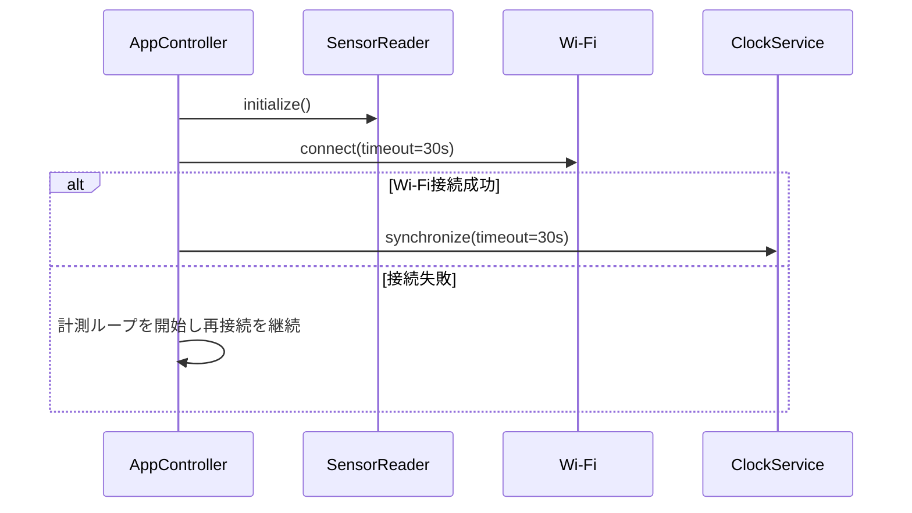

# SoraSense 詳細設計書 — センサーデバイス

## 2. 責務とモジュール

| モジュール | 責務 |
|---|---|
| `SensorReader` | ENV IV Unitの初期化、温度・湿度取得、読取値の有限値・範囲確認 |
| `ClockService` | NTP同期、UTC測定日時の生成、未同期状態の管理 |
| `MeasurementFactory` | UUID v4生成、送信ペイロード作成 |
| `ApiClient` | ローカルHTTP接続、JSON送信、応答分類 |
| `RetryController` | 未送信データ1件の保持、バックオフ、再送打切り |
| `StatusDisplay` | 接続・送信・認証・センサー異常の端末表示 |
| `AppController` | 初期化と非ブロッキングな計測・送信ループの制御 |

## 3. 利用ライブラリ

| 用途 | ライブラリ・方式 |
|---|---|
| 本体・画面 | M5Stack公式のM5StickC Plus2対応ライブラリ |
| ENV IV Unit | M5Stack公式ENV IV Unit対応ライブラリ |
| Wi-Fi | Arduino-ESP32 `WiFi` |
| HTTP | Arduino-ESP32 `WiFiClient`と`HTTPClient` |
| JSON | ArduinoJson |
| 時刻同期 | Arduino-ESP32 `configTzTime`または`configTime`によるNTP |
| UUID | 暗号学的乱数源`esp_random`を用いたRFC 4122 UUID v4生成 |

具体的なライブラリバージョンはファームウェアの依存定義に固定する。送信先は管理対象LAN内のFastAPIに限定し、`http://{host-lan-address}:8000`形式のベースURLを環境別設定として注入する。M5StickC Plus2自身を指す`localhost`または`127.0.0.1`は指定しない。

## 4. 起動シーケンス

センサー初期化失敗時は測定・送信を行わず、30秒間隔で再初期化する。Wi-FiまたはNTP失敗時もプロセスを停止せず再試行する。正確なUTCを取得できるまで測定値をAPIへ送信しない。

## 5. 計測処理

- 計測周期は60秒とし、前回処理終了からではなく単調増加時計に基づく予定時刻で起動する。
- 温度は-40.0～85.0℃、湿度は0.0～100.0%の有限値だけを有効とする。
- 無効値は送信せず、端末表示とカウンターを更新する。次回の計測は継続する。
- 有効値ごとに新しい`message_id`を発行し、同じ測定の再送では変更しない。
- 未送信データがある状態で新しい有効値を取得した場合、基本設計に従い新しい値で置き換える。置換時は新しい`message_id`を発行し、再送回数を0へ戻し、設定済みの次回再送日時を破棄して初回送信を可能にする。
- 送信中に未送信データを置き換えた場合、送信結果は送信対象の`message_id`が現在の未送信データの`message_id`と一致するときだけ状態へ反映する。置換前のデータに対する送信結果は無視する。

## 6. 時刻同期

- NTPサーバーは環境別設定とし、2つ以上指定可能にする。
- 起動後、Wi-Fi接続時にNTP同期し、以後6時間ごとに再同期する。
- NTP同期成功後のUTC時刻と単調増加時計を組み合わせ、時計の逆行で測定順序が崩れないようにする。
- 最終同期から24時間を超えた場合は時刻未保証とし、送信を停止して同期を優先する。
- `measured_at`は秒精度の`YYYY-MM-DDTHH:mm:ssZ`で送る。

## 7. 送信ペイロード

送信先、ヘッダー、JSON形式は`backend.md`の測定データAPIを正本とする。デバイスは次を設定する。

| 項目 | 値 |
|---|---|
| `Authorization` | `Bearer {DEVICE_API_KEY}` |
| `Content-Type` | `application/json` |
| `X-Request-ID` | `message_id`と同じ値 |
| 接続タイムアウト | 5秒 |
| 応答タイムアウト | 10秒 |

APIキーを画面、シリアルログ、エラー本文へ出力しない。

## 8. 再送アルゴリズム

| 設定 | 初期値 |
|---|---:|
| 初期間隔 | 5秒 |
| 倍率 | 2 |
| 最大間隔 | 300秒 |
| 最大試行回数 | 6回（初回送信を除く） |
| ジッター | 算出間隔の0～20%を加算 |

再送対象は接続失敗、タイムアウト、HTTP 429および全5xx（500、502、503、504等）とする。429で有効な`Retry-After`秒が返った場合は、その値と算出バックオフの大きい方を用いる。400、401、403は同じデータを再送しない。401、403では自動送信を停止し、設定修正後の再起動を要求する。その他の4xxは再送せず破棄する。

再送待機中も計測ループを止めない。待機にはブロッキングな長時間`delay`を使用せず、予定時刻を状態として保持する。最大回数到達後は当該データを破棄し、次の計測・送信を継続する。

## 9. 状態遷移

| 状態 | 遷移条件 | 次状態 |
|---|---|---|
| `INITIALIZING` | センサー・Wi-Fi・時刻準備完了 | `READY` |
| `READY` | 計測時刻到来 | `MEASURING` |
| `MEASURING` | 有効値取得 | `PENDING_SEND` |
| `PENDING_SEND` | 送信成功または重複受理 | `READY` |
| `PENDING_SEND` | 再送可能失敗 | `RETRY_WAIT` |
| `RETRY_WAIT` | 再送時刻到来 | `PENDING_SEND` |
| 任意 | 認証失敗 | `AUTH_ERROR` |

## 10. 設定値

`DEVICE_ID`、`DEVICE_API_KEY`、HTTPの`API_BASE_URL`、NTPサーバー、Wi-Fi認証情報をビルド時Secretまたは端末用の非公開設定で注入する。CA証明書は使用しない。リポジトリへ実値を登録しない。

## 11. ログと端末表示

シリアルログにはイベント名、結果、HTTP状態、試行回数、`message_id`の先頭8文字までを記録できる。測定値全件、APIキー、Wi-Fiパスワードは記録しない。端末には最新測定値、Wi-Fi状態、最終送信結果、時刻同期状態を表示する。
