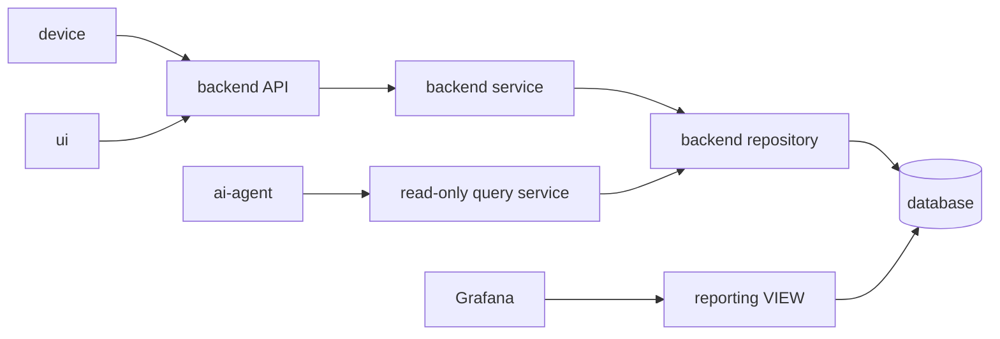

# SoraSense 詳細設計書

## 2. 適用範囲と設計原則

本詳細設計は、基本設計書で定めた初期リリースの構成を、実装・試験可能な粒度へ具体化する。基本設計の方式を変更する必要が生じた場合は、詳細設計だけで確定せず、基本設計書を先に更新する。利用者の振る舞い、対象範囲、品質条件または受入条件に影響する場合は、要件定義書も更新する。

- 初期リリースは単一利用者、単一デバイス、温度・湿度の2測定項目を対象とする。
- 日時は内部・API・DBでUTCを使用し、利用者への表示および日・時単位の集計境界は`Asia/Tokyo`に固定する。
- データ収集経路はGemini Developer APIへ依存させない。
- AI AgentおよびGrafanaには参照専用のデータ経路だけを提供する。
- 秘密情報と環境差分はソースコードではなく環境変数、Secretまたは設定ファイルで管理する。
- 本文に記載した制限値は初期値とし、環境変数または設定ファイルで変更可能な値は各文書に明記する。

## 3. 採用バージョン

| 対象 | バージョン・方針 |
|---|---|
| Python | 3.12系を依存管理ファイルで固定する |
| FastAPI / SQLAlchemy / Alembic | 採用時のバージョンを依存管理ファイルとロックファイルで固定する |
| PostgreSQL | 16系 |
| Grafana OSS | 採用時のメジャー・マイナーバージョンをDockerイメージタグで固定する |
| Arduinoライブラリ | `device.md`に定義したライブラリをバージョン固定する |
| Gemini SDK | `google-genai==2.20.0`を依存管理ファイルで固定する |
| Geminiモデル | Free Tier対象モデルを`GEMINI_MODEL`で指定し、既定値を`gemini-3.7-flash`とする |

## 4. 文書構成

| 文書 | 設計責務 | 基本設計からの主な引継ぎ |
|---|---|---|
| [device.md](device.md) | M5StickC Plus2の計測・時刻同期・送信 | Arduinoライブラリ、時刻同期、再送アルゴリズム |
| [backend.md](backend.md) | FastAPIのAPI、モジュール、処理、異常判定 | API仕様、クラス・関数、トランザクション、例外 |
| [database.md](database.md) | PostgreSQLの物理構造とマイグレーション | テーブル、VIEW、索引、DDL方針 |
| [ai-agent.md](ai-agent.md) | Agentと参照専用Tool | Tool入出力、Instructions、制限値 |
| [ui-grafana.md](ui-grafana.md) | AI質問画面とGrafana | HTMLフォーム、セッション、CSRF、表示、クエリ |
| [infrastructure-operations.md](infrastructure-operations.md) | 配置、設定、ログ、監視、バックアップ | ローカルネットワーク、Secret、ログ、復旧 |
| [test-design.md](test-design.md) | テストケースと受入確認 | 単体、結合、E2E、障害、性能、セキュリティ |

各仕様の正本は上表の担当文書とする。他文書では同じ仕様を再定義せず、正本を参照する。

## 5. 実装単位と依存方向

`routers`はHTTP入出力、`services`はユースケース、`repositories`は永続化、`agent`はAgent実行に責務を限定する。上位層から下位層への一方向依存とし、収集サービスからAgentサービスを呼び出さない。

## 6. 共通規約

### 6.1 識別子と日時

- `message_id`、AI要求IDおよびリクエストIDにはUUID v4を使用する。セッションIDは`ui-grafana.md`で定義する256ビット暗号学的乱数の不透明トークンを使用する。
- DBの日時型は`timestamptz`、APIはISO 8601のUTC表記（末尾`Z`）を使用する。
- サーバー時刻はUTCで扱い、OSとデバイスはNTPで同期する。
- `device_id`は英小文字、数字、ハイフンからなる1～64文字とする。

### 6.2 エラー分類

| 分類 | 例 | 利用者向け処理 | ログレベル |
|---|---|---|---|
| 入力・認証エラー | 不正形式、CSRF不一致 | 4xxと安全な説明 | INFOまたはWARNING |
| 一時的依存障害 | DB、Gemini、通信 | 503または機能別エラー表示 | ERROR |
| 想定外障害 | 未処理例外 | 500とリクエストID | ERROR |

内部例外、SQL、スタックトレース、秘密情報を外部応答へ含めない。

## 7. 要件トレーサビリティ

| 要件・受入条件 | 詳細設計の正本 |
|---|---|
| FR-001～005、AC-001のデバイス部分 | `device.md` |
| FR-004、FR-010～012、FR-030～034 | `backend.md`、`database.md` |
| FR-013～023、FR-050～052 | `database.md`、`ui-grafana.md` |
| FR-040～048、NFR-032、NFR-050～053 | `ai-agent.md`、`ui-grafana.md` |
| FR-060～063 | `ui-grafana.md` |
| NFR-001～003 | `backend.md`、`database.md`、`test-design.md` |
| NFR-010～012 | `infrastructure-operations.md`、`test-design.md` |
| NFR-020～025 | `backend.md`、`ai-agent.md`、`ui-grafana.md`、`infrastructure-operations.md` |
| NFR-030～033 | `device.md`、`database.md`、`ai-agent.md`、`infrastructure-operations.md` |
| NFR-040～043 | 全詳細設計文書、`test-design.md` |
| AC-001～011 | `test-design.md` |

## 8. 未確定事項の管理

実装を妨げる未確定事項は各担当文書の「未確定事項」に記録する。選択結果が基本設計の方式または要件へ影響しないライブラリのパッチバージョン等は、実装時に依存管理ファイルで確定できる。方式・セキュリティ・受入条件へ影響する事項は、実装前に対応する上位文書を更新する。
