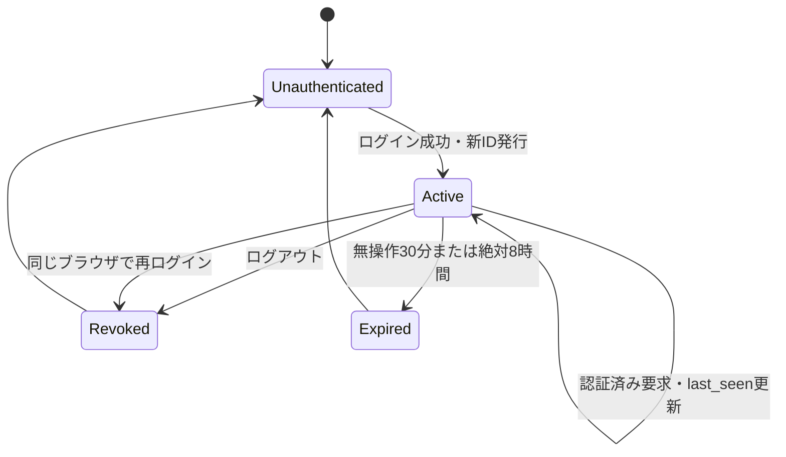

# SoraSense 詳細設計書 — UI・Grafana

## 2. 画面と経路

| 画面 | Method / Path | 認証 | 成功時 | 主な失敗時 |
|---|---|---|---|---|
| AIログイン | GET `/login` | 不要 | ログインフォームを表示 | なし |
| AIログイン | POST `/login` | 不要 | セッションを新規発行し`/agent`へ303 | 400、403、429 |
| AIアシスタント | GET `/agent` | 必須 | 質問フォームを表示 | `/login`へ303 |
| AI質問結果 | POST `/agent/questions` | 必須 | Agent実行結果を同一画面に表示 | 400、403、409、413、415、503 |
| ログアウト | POST `/logout` | 必須 | セッションを破棄し`/login`へ303 | 403 |
| Grafanaログイン | Grafana標準 | 不要 | Grafanaローカル認証 | Grafana標準 |
| ダッシュボード | Grafana標準URL | 必須 | 現在値、履歴、統計、アラート、状態 | Grafana標準 |

認証が必要なGETでセッションが存在しないか失効している場合は、Cookieを削除して`/login?reason=session_expired`へ303で遷移する。状態変更POSTはリダイレクトで処理せず、安全なエラー画面を返す。AI画面とGrafanaダッシュボードには相互リンクを置く。管理画面、デバイス変更画面、閾値変更画面は作らない。

## 3. モジュール構成と責務

| 配置 | 主な責務 | 担当しない処理 |
|---|---|---|
| `app/web/router.py` | 経路、フォーム値取得、HTTP応答・リダイレクト | パスワード検証、セッション状態遷移、Agent処理 |
| `app/web/schemas.py` | ログイン・質問フォームの正規化と入力検証 | 認証成否、HTML生成 |
| `app/web/dependencies.py` | 現在のセッション取得、認証必須判定 | セッション保存方式の詳細 |
| `app/web/templates/` | Jinja2の自動エスケープによるHTML生成 | 認証・業務判断 |
| `app/web/static/styles.css` | CSPで許可する同一オリジンCSS | JavaScript、外部リソース読込 |
| `app/security/web_auth.py` | 固定利用者名とArgon2idハッシュの定時間認証 | Cookie発行、HTTP応答 |
| `app/security/session.py` | セッション生成、取得、更新、失効、CSRF・フォームトークン管理 | HTTP、HTML、Agent処理 |
| `app/security/login_rate_limit.py` | IP・利用者名単位の試行記録と制限判定 | 認証情報の検証 |
| `app/security/headers.py` | AI画面応答へのセキュリティヘッダー付与 | HTTPS終端、HSTS付与 |

セッションストアとレート制限ストアは初期リリースではプロセス内メモリに保持する。FastAPIは単一ワーカープロセスで稼働し、再起動時には全セッションと試行履歴を失効させる。複数ワーカー化する場合は共有ストアへ置き換え、プロセスローカル状態のままスケールアウトしない。

## 4. 設定値

設定は既存の`APP_`接頭辞と`Settings`を使用する。秘密値は`SecretStr`として扱い、モデル表現、例外およびログへ実値を含めない。

| 環境変数 | 型・既定値 | 検証・用途 |
|---|---|---|
| `APP_WEB_USERNAME` | 文字列、未設定可 | 設定時は1～128文字。Web UI有効時は必須 |
| `APP_WEB_PASSWORD_HASH` | Secret、未設定可 | Argon2id encoded hash。Web UI有効時は必須 |
| `APP_WEB_SESSION_COOKIE_NAME` | `sorasense_session` | Cookie名として安全な英数字・`_`・`-`、1～64文字 |
| `APP_WEB_SESSION_IDLE_SECONDS` | `1800` | 60～86400秒 |
| `APP_WEB_SESSION_ABSOLUTE_SECONDS` | `28800` | 無操作期限より長く、最大604800秒 |
| `APP_WEB_LOGIN_WINDOW_SECONDS` | `900` | 試行集計窓 |
| `APP_WEB_LOGIN_MAX_ATTEMPTS` | `5` | 制限開始前に許可する失敗回数 |
| `APP_WEB_LOGIN_LOCK_SECONDS` | `900` | 制限時間 |
| `APP_WEB_FORM_MAX_BYTES` | `4096` | ログイン・質問フォーム共通の本文上限 |
| `APP_WEB_SECURE_COOKIE` | 本番`true`、開発・テスト`false`可 | 本番で`false`なら起動失敗 |

Web UIは利用者名とパスワードハッシュの両方が設定された場合だけ有効とする。片方だけの設定は全環境で起動時エラーとする。本番環境では両方を必須とする。開発・テストで両方が未設定の場合はWeb経路を登録せず、測定APIとヘルスチェックだけを利用可能にする。

## 5. 入力契約

| フィールド | HTML | 正規化・制約 |
|---|---|---|
| `username` | `input type=text` | 前後空白を除去せず1～128文字。認証後も再表示しない |
| `password` | `input type=password` | 1～256文字。再表示・ログ出力しない |
| `question` | `textarea` | 前後空白除去後1～2000文字。元入力・正規化後入力ともログ出力しない |
| `csrf_token` | `input type=hidden` | 256ビット乱数。セッション値と定時間比較 |
| `form_token` | `input type=hidden` | 質問フォームごとの256ビット乱数。1回だけ使用可能 |

フォームはUTF-8の`application/x-www-form-urlencoded`だけを受け付け、文字コード指定がある場合はUTF-8だけを許可する。クライアントサイドJavaScriptは使用しない。Content-Lengthだけを信用せず、ストリーム読込み時にも`APP_WEB_FORM_MAX_BYTES`を適用する。上限超過は413、不正Content-Typeは415、形式・文字数違反は400とし、入力検証で拒否した質問ではAgentを呼び出さない。

## 6. 認証設計

### 6.1 認証処理

`APP_WEB_USERNAME`とArgon2idの`APP_WEB_PASSWORD_HASH`を設定から取得する。ログインPOSTは次の順序で処理する。

1. 本文サイズとContent-Typeを検証する。
2. ログインフォーム用CSRFトークンを検証する。
3. 接続元IP・正規化済み利用者名の両キーについてレート制限を確認する。
4. 利用者名を定時間比較し、パスワードをArgon2idで検証する。
5. 失敗時は両キーへ失敗を記録し、同一の一般的なエラーを返す。
6. 成功時は該当キーの失敗履歴を消去し、既存セッションを破棄して新しいセッションIDを発行する。
7. セッションCookieを設定し、`/agent`へ303で遷移する。

存在しない利用者名でも、設定済みハッシュと同等コストのダミーハッシュを検証し、利用者の存在と失敗理由を応答時間・本文・ステータスで区別しにくくする。ハッシュ形式不正は設定エラーとして起動時に拒否する。パスワード、ハッシュ、Cookie、CSRF・フォームトークンをログへ記録しない。

### 6.2 ログインCSRF

ログインCSRFは、GET `/login`で発行する短命な署名付きトークンをCookieとhidden fieldの二重送信方式で検証する。Cookieは認証セッションCookieと別名にし、`Secure`、`HttpOnly`、`SameSite=Lax`、`Path=/login`、有効期限10分とする。サーバー秘密鍵はプロセス起動時に生成するため、再起動後のトークンは無効となる。これにより、認証前にもログインCSRFを防ぎつつ、ログイン用のサーバー側セッションは作成しない。

### 6.3 レート制限

接続元IPと利用者名のどちらか一方が、15分窓で5回失敗した後は15分間制限する。制限中はパスワード検証を行わず429と`Retry-After`を返す。成功時は該当する両キーの失敗履歴を消去する。履歴は期限切れエントリを各判定時に削除し、最大10,000キーを超えた場合は最終更新が古い期限切れキーから削除する。

接続元IPは、信頼済みReverse Proxyが上書きした接続情報だけを用いる。任意クライアントから届く`X-Forwarded-For`を直接信用しない。IPと利用者名は平文でログへ出さず、それぞれ種別を分けた鍵付きハッシュで記録する。

## 7. セッション設計

### 7.1 セッションデータ

| 項目 | 内容 |
|---|---|
| `session_id` | 256ビット暗号学的乱数のURL-safe不透明トークン。Cookieだけに保存 |
| `user_id` | 初期リリース固定値`default-user` |
| `created_at` | UTCの生成時刻 |
| `last_seen_at` | UTCの最終利用時刻 |
| `csrf_token` | 256ビット暗号学的乱数 |
| `form_tokens` | 未使用質問トークンと発行時刻。最大5件 |

セッションストアにはCookie値そのものではなく、鍵付きハッシュをキーとして保存する。Cookieが漏えいしていない限り照合できる必要があるため、通常の高速ハッシュではなく、プロセス起動時秘密鍵によるHMACを用いる。認証済みセッションは無操作30分または生成から8時間の早い方で失効する。サーバー時刻は注入可能なUTC Clockから取得する。

### 7.2 状態遷移

ログイン成功時はリクエストに含まれる任意のCookie値を再利用せず、既存セッションを破棄して新規IDを発行する。認証済み要求では絶対期限と無操作期限を確認してから`last_seen_at`を更新する。ログアウトではCSRF検証後にサーバー側セッションを削除し、Cookieを同一属性・`Max-Age=0`で削除する。

### 7.3 Cookie属性

セッションCookieは`Secure`、`HttpOnly`、`SameSite=Lax`、`Path=/`を付与し、`Domain`は設定しない。ブラウザ終了時に破棄されるセッションCookieとし、サーバー側期限を正本にする。開発・テストでHTTPを使う場合だけ`Secure=false`を許可し、本番では必ず`true`とする。

## 8. CSRFとワンタイムフォームトークン

認証後の状態変更POSTは、セッションに保存したCSRFトークンとhidden fieldを定時間比較する。Cookie値をCSRFトークンとして流用しない。不一致、欠落、形式不正は403とし、処理を実行しない。

GET `/agent`と質問結果画面の描画時に新しい`form_token`を発行する。POST `/agent/questions`では、CSRF検証後、Agent呼出し前にフォームトークンを原子的に消費する。欠落・不一致・使用済み・発行から30分超過は409とする。検証後にAgentが失敗した場合もトークンは復活させず、新しいフォームを表示して明示的な再送を求める。セッションごとに未使用トークンを最大5件とし、超過時は古いものから失効させる。

## 9. 経路別処理

### 9.1 GET `/login`

- 有効な認証済みセッションがある場合は`/agent`へ303で遷移する。
- ログインCSRFトークンを発行し、ログインフォームを表示する。
- `reason=session_expired`は定義済みの案内文への選択にだけ用い、任意文字列を表示しない。

### 9.2 POST `/login`

- 6章の認証処理を行う。
- 認証失敗は403、レート制限は429とする。
- 認証失敗時は入力された利用者名とパスワードを再表示しない。

### 9.3 GET `/agent`

- 有効なセッションを要求し、質問用CSRF・フォームトークンを含む画面を表示する。
- AgentやDBへアクセスしない。

### 9.4 POST `/agent/questions`

1. 本文境界、セッション、CSRF、質問、フォームトークンの順に検証する。
2. ワンタイムフォームトークンを消費する。
3. フェーズ7で定義するAgentユースケースを呼び出す。
4. 成功・データなし・利用不能を型付き表示モデルへ変換する。
5. 新しいフォームトークンを発行して同一画面を表示する。

フェーズ6では手順3を呼び出さず、質問受付境界までをテスト用Fakeで確認する。実Agent接続と回答モデルの詳細は`ai-agent.md`を正本とする。

### 9.5 POST `/logout`

- セッションとCSRFを検証後、セッションを削除する。
- Cookieを削除し、`/login`へ303で遷移する。
- 削除済みセッションの再利用を拒否する。

## 10. AI回答表示

成功時は同一画面に、質問フォーム、回答、対象デバイス、対象期間、タイムゾーン、主要根拠値、リクエストIDを表示する。回答はHTMLとして信頼せず、Jinja2 Environmentの自動エスケープを有効にしてプレーンテキストとして表示する。テンプレートで`safe`フィルター、HTML文字列の直接連結、ユーザー入力を含むインラインCSSを使用しない。

| 状態 | 表示 |
|---|---|
| データなし | 指定条件に該当するデータがないことを表示 |
| AI利用不能 | 収集・Grafanaは利用可能であることと再試行案内を表示 |
| 入力不正 | 対象フィールド付近に定義済みの理由を表示し、秘密情報を含めない |
| セッション失効 | ログイン画面へ遷移し、再認証を案内 |
| 想定外エラー | 一般的な説明とリクエストIDを表示 |

エラー表示は内部例外、SQL、スタックトレース、設定値、質問本文を含めない。表示用メッセージはエラーコードからサーバー側で選択し、例外文字列をテンプレートへ直接渡さない。

## 11. セキュリティヘッダー

AI画面のHTML・リダイレクト・エラー応答へ次を付与する。

| ヘッダー | 値 |
|---|---|
| `Content-Security-Policy` | `default-src 'self'; style-src 'self'; img-src 'self'; base-uri 'none'; form-action 'self'; frame-ancestors 'none'` |
| `X-Content-Type-Options` | `nosniff` |
| `Referrer-Policy` | `no-referrer` |
| `Cache-Control` | `no-store` |
| `X-Frame-Options` | `DENY` |

HTTPS終端では`Strict-Transport-Security: max-age=31536000; includeSubDomains`をReverse Proxyが付与する。テンプレートにインラインスクリプト、インラインスタイルおよび外部CDN参照を置かない。

## 12. ログ設計

| イベント | レベル | 記録項目 |
|---|---|---|
| `web_login_succeeded` | INFO | request_id、利用者固定ID、IP鍵付きハッシュ |
| `web_login_failed` | WARNING | request_id、利用者名鍵付きハッシュ、IP鍵付きハッシュ、理由分類 |
| `web_login_rate_limited` | WARNING | request_id、制限キー種別、Retry-After |
| `web_session_rejected` | INFO | request_id、理由分類（missing/expired/revoked） |
| `web_csrf_rejected` | WARNING | request_id、経路、認証前後の区分 |
| `web_form_token_rejected` | INFO | request_id、理由分類（missing/unknown/used/expired） |
| `web_logout_succeeded` | INFO | request_id、利用者固定ID |
| `web_unexpected_error` | ERROR | request_id、例外分類 |

ログには利用者名、パスワード、質問・回答本文、Cookie、セッションID、CSRF・フォームトークン、ハッシュ設定値を含めない。鍵付きハッシュはログ相関専用の別鍵を使い、セッションストア用HMACと共有しない。

## 13. Grafanaデータソース

PostgreSQLデータソースは`grafana_reader`を使用し、`reporting`スキーマのVIEWだけを参照する。接続情報はProvisioning用Secretから取得し、ダッシュボードJSONへ埋め込まない。匿名アクセス、編集可能な利用者登録、Explore機能は初期リリースで無効化する。

## 14. ダッシュボード構成

| パネル | データ | 可視化 | 更新 |
|---|---|---|---|
| デバイス状態 | `v_device_statuses` | Stat、状態別色 | 30秒 |
| 最新温度 | `v_latest_measurements` | Stat、℃ | 30秒 |
| 最新湿度 | `v_latest_measurements` | Stat、% | 30秒 |
| 最終受信日時 | `v_latest_measurements` | Stat、`Asia/Tokyo` | 30秒 |
| 温湿度履歴 | `v_measurement_series` | Time series、2軸 | 選択期間 |
| 温湿度統計 | `v_measurement_series` | Table、min/max/avg | 選択期間 |
| 測定データ欠損 | `v_measurement_gaps` | Table、欠損区間・推定件数 | 選択期間 |
| アラート履歴 | `v_alert_history` | Table | 選択期間 |

ダッシュボード変数は単一`device_id`だけとし、設定値から固定する。期間指定にはGrafana標準Time Pickerを使用する。SQLの期間条件にはGrafanaの時間マクロを用い、利用者入力を文字列連結しない。

## 15. 表示規則

- 温度は小数第1位と`℃`、湿度は小数第1位と`%`で表示する。
- GrafanaとAI画面の日時は`Asia/Tokyo`で表示し、利用者によるタイムゾーン選択は提供しない。
- データなしを0として表示しない。
- ONLINEは緑、STALEは黄、OFFLINEは赤とし、色だけでなくテキストも表示する。
- アラートは項目、方向、状態、閾値、発生値、発生・解消日時を確認可能にする。

## 16. Provisioning

データソース、ダッシュボード、フォルダー設定をGit管理可能なProvisioningファイルで作成する。GrafanaのDBを永続化前提にせず、環境再構築後も同一表示を復元できることを結合テストで確認する。

## 17. 要件トレーサビリティ

| 設計項目 | 対応要件・受入条件 |
|---|---|
| 画面・経路・相互リンク | FR-040、FR-060～063、AC-002、AC-004 |
| 認証・セッション・CSRF・レート制限 | NFR-020～024、AC-009 |
| 入力境界・安全な表示 | FR-040、NFR-022、NFR-024、AC-004、AC-009 |
| Agent障害時表示 | FR-048、NFR-002、NFR-011、AC-005 |
| Grafana参照専用構成 | FR-020～023、FR-032、FR-050～052、AC-002、AC-003、AC-006 |
| 固定タイムゾーン表示 | NFR-030、AC-010 |

## 18. 未確定事項

フェーズ6の実装を妨げる未確定事項はない。共有セッションストアの製品選定は、複数ワーカー化または水平スケールを要件化する時点で基本設計から見直す。
